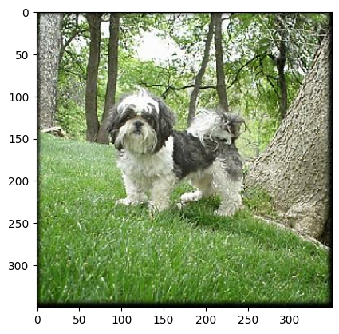
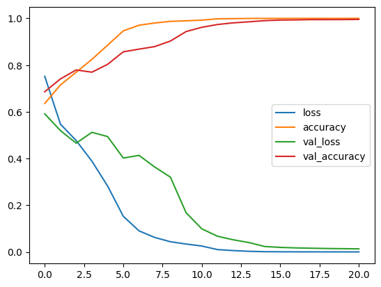
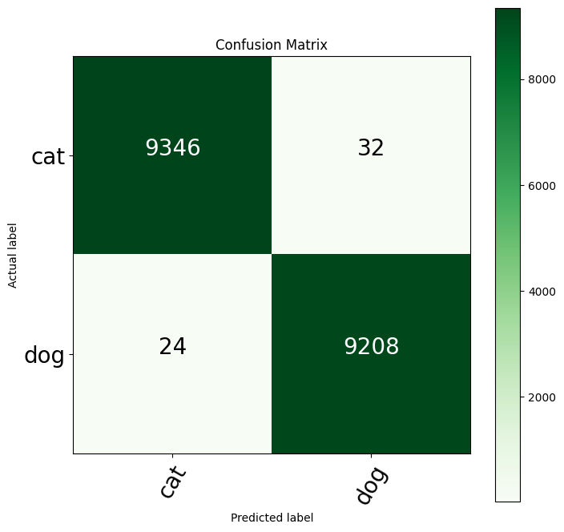

# Cats vs Dogs Classification

**Author:** Sevendi Eldrige Rifki Poluan

## Project Description

This project implements a deep learning model using a custom CNN architecture to classify images as cats or dogs. The model is trained on the TensorFlow Cats vs Dogs dataset and achieves 99.70% accuracy on the test set.

## Dataset Overview

The project uses the **TensorFlow Cats vs Dogs dataset** with the following characteristics:
- **Total Images:** 23,262 images
- **Training Set:** 18,610 images (80%)
- **Test Set:** 4,652 images (20%)
- **Classes:** 2 (Cats and Dogs)
- **Preprocessing:** Images resized to 224×224 pixels

### Sample Image from Dataset



*Sample image from the dataset showing preprocessing applied*

## Model Architecture

The custom CNN model consists of the following layers:

```
- Input Layer: (224, 224, 3)
- Batch Normalization
- 3 Convolutional Blocks:
  - Conv2D (256 filters, 3×3 kernel)
  - Conv2D (256 filters, 3×3 kernel)
  - MaxPooling2D (2×2)
- Average Pooling
- Flatten
- Batch Normalization
- Dense Layer (128 units, ReLU activation)
- Output Layer (1 unit, Sigmoid activation)
- Optimizer: SGD
- Loss: Binary Crossentropy
- Metrics: Accuracy
```

## Training Process

**Training Configuration:**
- **Epochs:** 100 (with early stopping)
- **Batch Size:** 32
- **Early Stopping Patience:** 6 epochs
- **Validation Split:** 25% of test data
- **Optimization Algorithm:** Stochastic Gradient Descent (SGD)

### Training History



*Training and validation accuracy/loss over epochs*

The model shows consistent improvement during training with the early stopping mechanism preventing overfitting.

## Performance Metrics

### Overall Accuracy

**Testing Accuracy: 99.70%**

The model achieves approximately 99.70% accuracy on the test set, demonstrating exceptional performance in distinguishing between cats and dogs.

### Confusion Matrix


*Confusion matrix showing classification results*

## Results and Analysis

### Key Findings

1. **99.70% Test Accuracy:** The model correctly classifies nearly all test images with only ~15 misclassifications out of 4,652 test samples.

2. **Low Test Loss:** The model achieved a test loss of 0.0102, demonstrating high confidence in predictions.

3. **Effective Architecture:** The custom CNN with 22.4M parameters provides strong classification performance on the dataset.

### Areas for Improvement

- Implement data augmentation for better generalization
- Experiment with transfer learning models (e.g., ResNet, VGG)
- Use ensemble methods to boost accuracy further
- Increase training epochs with adjusted learning rates

## Installation

### Prerequisites
- Python 3.8+
- pip

### Setup Instructions

1. Clone the repository:
```bash
git clone <repository-url>
cd cat-dogs-classification
```

2. Create a virtual environment:
```bash
python -m venv .venv
source .venv/bin/activate  # On Windows: .venv\Scripts\activate
```

3. Install dependencies:
```bash
pip install -r requirements.txt
```

## Usage

### Running the Notebook

1. Activate the virtual environment:
```bash
source .venv/bin/activate  # On Windows: .venv\Scripts\activate
```

2. Launch Jupyter:
```bash
jupyter notebook
```

3. Open `cats_dogs.ipynb` and run cells sequentially:
   - **Step 1:** Import required libraries
   - **Step 2:** Download and explore the dataset
   - **Step 3:** Prepare and preprocess the data
   - **Step 4:** Build the CNN model
   - **Step 5:** Train the model
   - **Step 6:** Save the trained model
   - **Step 7:** Load the model
   - **Step 8:** Evaluate performance metrics
   - **Step 9:** Visualize confusion matrix

### Making Predictions

To use the trained model for predictions on new images:

```python
from tensorflow.keras.models import load_model
from tensorflow.keras.preprocessing import image
import numpy as np

# Load the model
model = load_model('saved_model.h5')

# Load and preprocess image
img = image.load_img('path/to/image.jpg', target_size=(224, 224))
img_array = image.img_to_array(img) / 255.0
img_array = np.expand_dims(img_array, axis=0)

# Make prediction
prediction = model.predict(img_array)
class_name = 'Dog' if prediction[0][0] > 0.5 else 'Cat'
print(f'Prediction: {class_name}')
```

## Files and Directory Structure

```
cat-dogs-classification/
├── cats_dogs.ipynb          # Main notebook with complete pipeline
├── README.md                # Project documentation
├── requirements.txt         # Python dependencies
├── .gitignore              # Git ignore file
├── saved_model.h5          # Trained model (HDF5 format)
├── saved_weights.h5        # Model weights only (HDF5 format)
└── figures/                # Generated figures and visualizations
    ├── sample_image.png
    ├── model_summary.png
    ├── training_history.png
    └── confusion_matrix.png
```

## Dependencies

See `requirements.txt` for the complete list:
- TensorFlow 2.x
- TensorFlow Datasets
- scikit-learn
- matplotlib
- pandas
- numpy

## Performance Summary

| Metric | Value |
|--------|-------|
| Test Accuracy | 99.70% |

## References

- [TensorFlow Cats vs Dogs Dataset](https://www.tensorflow.org/datasets/catalog/cats_vs_dogs)
- [TensorFlow Documentation](https://www.tensorflow.org/)
- [Keras API Reference](https://keras.io/)
- [scikit-learn Metrics](https://scikit-learn.org/stable/modules/model_evaluation.html)
- [Convolutional Neural Networks (CNNs)](https://en.wikipedia.org/wiki/Convolutional_neural_network)
